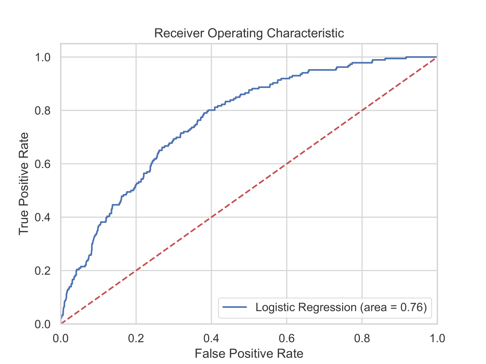
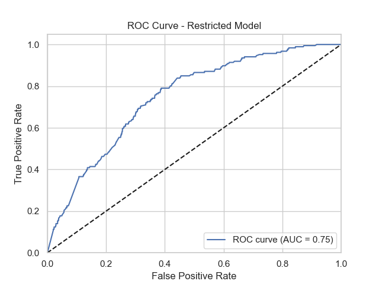

# QMB6315: Python for Business Analytics
## Spring 2025

# Assignment 5

Save your scripts and materials in a folder called ```assignment_05``` in your GitHub respository.


## Full Logistic Regression Model

This is the regression result from the full model estimated in part (a).

```

# Regression output goes here.
 
 Logit Regression Results                           
==============================================================================
Dep. Variable:                default   No. Observations:                 2377
Model:                          Logit   Df Residuals:                     2368
Method:                           MLE   Df Model:                            8
Date:                Wed, 23 Apr 2025   Pseudo R-squ.:                 0.08341
Time:                        08:43:14   Log-Likelihood:                -598.01
converged:                       True   LL-Null:                       -652.42
Covariance Type:            nonrobust   LLR p-value:                 6.610e-20
================================================================================
                   coef    std err          z      P>|z|      [0.025      0.975]
--------------------------------------------------------------------------------
bmaxrate        -4.7491      0.635     -7.476      0.000      -5.994      -3.504
amount        5.649e-05   1.66e-05      3.396      0.001    2.39e-05    8.91e-05
close            0.4433      0.161      2.762      0.006       0.129       0.758
AA              -4.5310      0.607     -7.470      0.000      -5.720      -3.342
A               -3.3301      0.450     -7.406      0.000      -4.211      -2.449
B               -3.3115      0.447     -7.402      0.000      -4.188      -2.435
C               -2.0781      0.245     -8.477      0.000      -2.559      -1.598
D               -1.4386      0.205     -7.008      0.000      -1.841      -1.036
bankcardutil    -0.9276      0.181     -5.138      0.000      -1.282      -0.574
================================================================================
```

This model has the following ROC curve.





## Logistic Regression Model Useful for Credit Decisions

This is the regression result from the model based on only the information 
available when making a credit decision.

```
Logistic Regression Results (Restricted Model):
                           Logit Regression Results                           
==============================================================================
Dep. Variable:                default   No. Observations:                 2377
Model:                          Logit   Df Residuals:                     2369
Method:                           MLE   Df Model:                            7
Date:                Wed, 23 Apr 2025   Pseudo R-squ.:                  0.1074
Time:                        13:08:45   Log-Likelihood:                -582.38
converged:                       True   LL-Null:                       -652.42
Covariance Type:            nonrobust   LLR p-value:                 4.890e-27
================================================================================
                   coef    std err          z      P>|z|      [0.025      0.975]
--------------------------------------------------------------------------------
const           -1.5182      0.172     -8.822      0.000      -1.855      -1.181
bankcardutil    -0.4829      0.193     -2.500      0.012      -0.861      -0.104
close            0.6210      0.163      3.809      0.000       0.301       0.941
AA              -3.0859      0.597     -5.171      0.000      -4.255      -1.916
A               -2.0579      0.431     -4.780      0.000      -2.902      -1.214
B               -2.1922      0.428     -5.125      0.000      -3.030      -1.354
C               -1.2641      0.236     -5.358      0.000      -1.727      -0.802
D               -0.8801      0.204     -4.323      0.000      -1.279      -0.481
================================================================================


```

This model has the following ROC curve.




